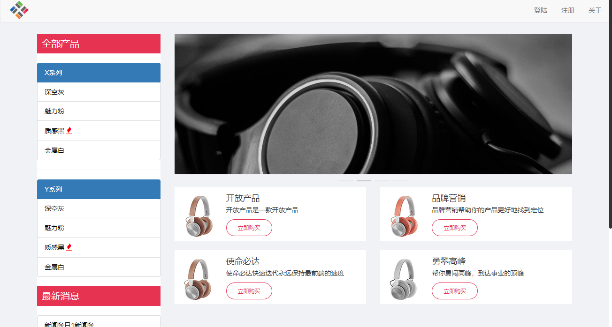
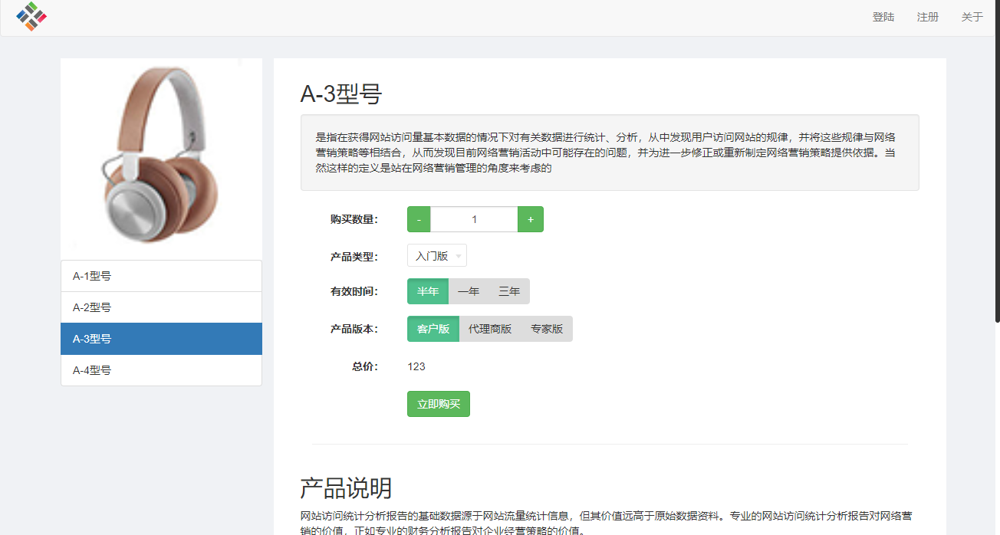
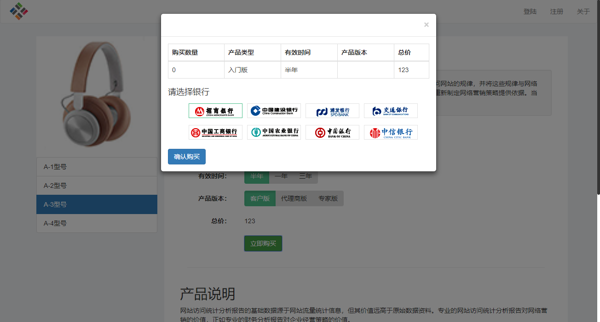
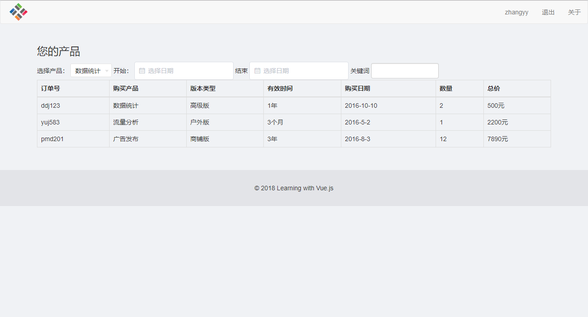

# Vue Mall

> A Vue.js project

## 技术栈

- HTML CSS
- ES6
- Vue
- vue-router
- vue-resource
- Bootstrap

## 项目结构图

```
└─ src
    │
    ├─ assets // 静态资源
    │
    ├─ components //组件
    │   ├─ bankChooser.vue //选择组件
    │   ├─ checkOrder.vue  // 确认订单
    │   ├─ dialog.vue // 弹框
    │   ├─ layout.vue
    │   ├─ logForm.vue // 登陆组件
    │   ├─ regForm.vue // 注册组件
    │   ├─ slideShow.vue //轮播组件
    │   │
    │   └─ base
    │       ├─ chooser.vue // 单选组件
    │       ├─ counter.vue // 计数组件
    │       ├─ multiplyChooser.vue //多选组件
    │       └─ selection.vue // 下拉选择组件
    │
    ├─ pages // 页面
    │   ├─ detail.vue
    │   ├─ index.vue
    │   ├─ orderList.vue
    │   │
    │   └─details
    │       ├─ analysis.vue
    │       ├─ count.vue
    │       ├─ forecast.vue
    │       └─ publish.vue
    │
    ├─ router
    │   └─ index.js // 路由配置
    │
    ├─ App.vue
    │
    └─ main.js
```

## 展示图




